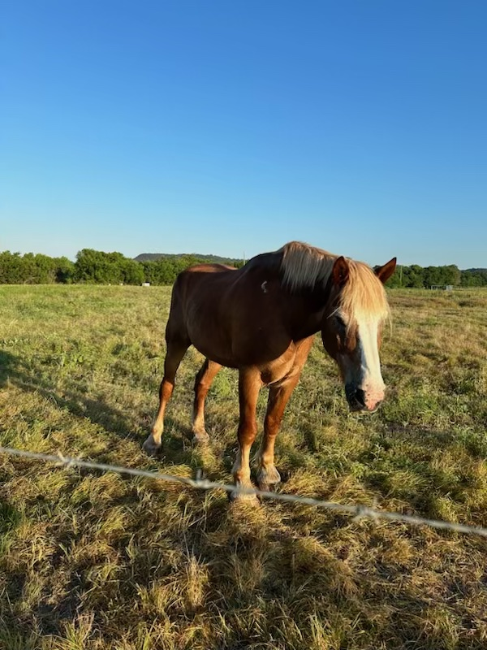
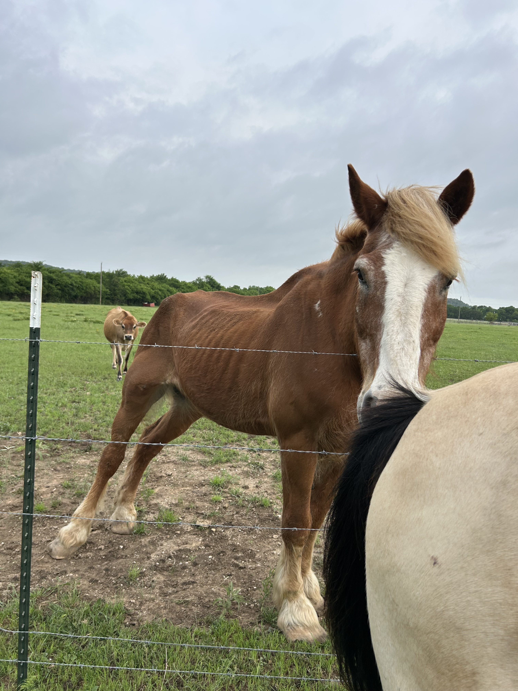

## Sarge's Story

<em>Sarge at the time of sale</em>

On September 29, 2023, the Carter family purchased Sarge, a large, healthy Belgian draft horse. At first, Sarge seemed to settle in, but over time, his condition began to decline. 

<em>Sarge in June 2024, 9 months after the sale</em>

He became noticeably thin, his ribs showing beneath his coat, and his hooves grew long and untrimmed. Sarge’s once gentle spirit faded as he struggled with hunger and discomfort.

Nearly a year later, on June 30, 2024, an anonymous report was made expressing concerns about Sarge’s well-being. Officer Robert Flemming responded to the call to check on Sarge’s welfare.
<a href="reports/2024-163880.pdf" target="_blank">After a thorough check, Officer Flemming found no issues with Sarge</a>.

The Carter family was outraged that someone would request a wellness check on Sarge and began to make accusations against their neighbors. Sarge's health was in decline but the family refused to acknowledge it.

Two months later, on August 7, 2024, another anonymous report was made about Sarge’s condition. This time, Officer Lou Corwin responded to the call. <a href="reports/2024-199408.pdf">Officer Corwin found Sarge in poor condition, walking with difficulty, and exhibiting signs of neurological issues.</a> In only two months, more serious signs are present. Despite these troubling findings, no further action was taken.

<a href="reports/2024-200221.pdf">Meanwhile, Lin Carter was infuriated by the repeated reports.</a> Accusations were made toward many in the neighborhood with a warning to stop calling the sheriff. She suspected the Mitchells were behind the calls and requested a Criminal Trespass Warning against them. 

In April 2025, another anonymous report was made about Sarge’s condition. On April 29, Officer Brian Hetzer responded to the call. <a href="reports/2025-105144.pdf">Officer Hetzer found “the complaint to be unfounded” and noted, “Horse does not appear to be malnourished.”</a> <em>This calls into question the expertise of the officers involved in the case.</em> No changes were made to Sarge's care, and he continues to suffer.

The Carters confronted the Mitchells at their front gate, again making baseless accusations, but this time including threats of violence. Two days later they learned of who had made the report and began to harass the caller, threatening lawsuits. The Carter's stil do not acknowledge Sarge's poor health condition. 

Christy, Sarge’s previous owner, learned about his current condition around this time. She was shocked to see Sarge in such poor condition and was concerned for his well-being. She reached out to Lin Carter (the new owner) several times since the sale of Sarge to see how he was doing however, the texts were ignored. At the time of the sale, Christy explained in detail the care Sarge would need to remain healthy.

Christy reached out to authorities at the Johnson County Sheriff’s Office via email expressing her concerns about Sarges well-being, however this fell on deaf ears. The Johnson County Sheriff's Office did not respond or acknowledge her communications.

Christy reached out to a lot of organizations for assistance. All willing to help however the Johnson County Sheriff’s Department would need to give the green light. 

Click here to view  Christy’s latest email sent June 3, 2025 to Johnson County Sheriff’s Office. 

 

Please pray for Sarge to get the care and love he deserves. The Fort Worth Police Department put him front and center as he was the lead horse in parades. Let’s put him front and center as well. 

