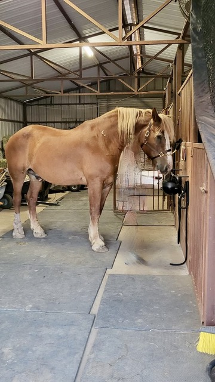

# In Decline

In August 2023, the Carter family purchased Sarge, a large Belgian draft horse. At first, Sarge seemed to settle in, but over time, his condition began to decline. He became noticeably thin, his ribs showing beneath his coat, and his hooves grew long and untrimmed. Sarge’s once gentle spirit faded as he struggled with hunger and discomfort.

Nearly a year later, in late June 2024, an anonymous report was made expressing concerns about Sarge’s well-being. On June 30th, 2024, Officer Robert Flemming responded to the call to check on Sarge’s welfare.

!(After a thorough check, Officer Flemming found no issues with Sarge)[reports/2024-163880.pdf].